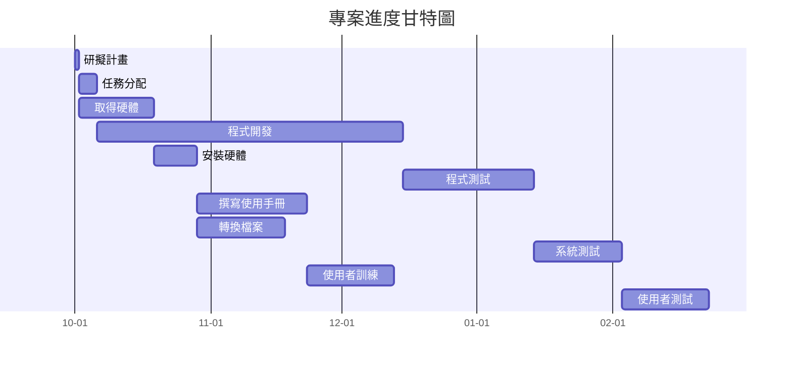
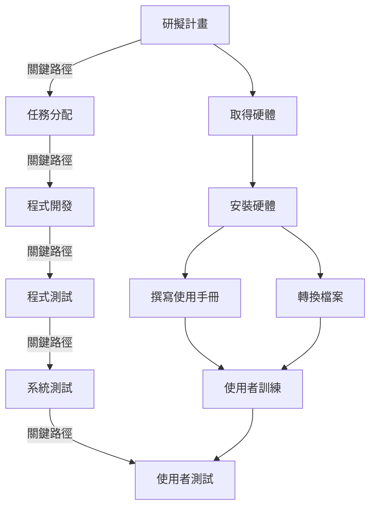

### 甘特圖

```mermaid
gantt
    title 專案進度甘特圖
    dateFormat  YYYY-MM-DD
    axisFormat  %m-%d

    
    研擬計畫         :a1, 2025-10-01, 1d
    任務分配         :a2, after a1, 4d
    取得硬體         :a3, after a1, 17d
    程式開發         :a4, after a2, 70d
    安裝硬體         :a5, after a3, 10d
    程式測試         :a6, after a4, 30d
    撰寫使用手冊      :a7, after a5, 25d
    轉換檔案         :a8, after a5, 20d
    系統測試         :a9, after a6, 20d
    使用者訓練       :a10, after a7 after a8, 20d
    使用者測試       :a11, after a9 after a10, 20d

   
    
```
### PERT 圖

```mermaid
flowchart TD
 a1[研擬計畫] -- 1天 --> a2[任務分配]
    a1 -- 1天 --> a3[取得硬體]
    a2 -- 4天 --> a4[程式開發]
    a3 -- 17天 -->a5[安裝硬體]
    a4 -- 70天 --> a6[程式測試]
    a5 -- 10天 --> a7[撰寫使用手冊]
    a5 -- 10天 --> a8[轉換檔案]
    a6 -- 30天 --> a9[系統測試]
    a7 -- 25天 --> a10[使用者訓練]
    a8 -- 20天 --> a10[使用者訓練]
    a9 -- 20天 --> a11[使用者測試]
    a10 -- 20天 --> a11[使用者測試]

```

### CPM 圖

```mermaid
flowchart TD
 a1[研擬計畫] -- 關鍵路徑 --> a2[任務分配]
    a1 --> a3[取得硬體]
    a2 -- 關鍵路徑 --> a4[程式開發]
    a3 --> a5[安裝硬體]
    a4 -- 關鍵路徑 --> a6[程式測試]
    a5 --> a7[撰寫使用手冊]
    a5 --> a8[轉換檔案]
    a6 -- 關鍵路徑 --> a9[系統測試]
    a7 --> a10[使用者訓練]
    a8 --> a10
    a9 -- 關鍵路徑 --> a11[使用者測試]
    a10 --> a11

```
